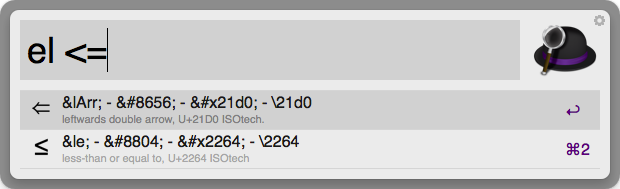
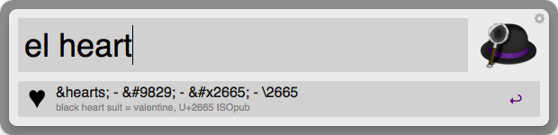
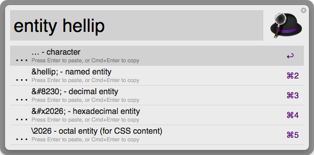

HTML Entity Lookup
==================

This is an Alfred 2 version of Remy's Sharp [excellent tool](http://leftlogic.com/projects/entity-lookup/).

Installation
------------

- Download "[HTMLEntityLookup.alfredworkflow](https://github.com/ajgon/alfred2-html-entity-lookup/blob/master/HTMLEntityLookup.alfredworkflow?raw=true)" extension.
- Double click the downloaded "HTMLEntityLookup.alfredworkflow" file to install. **Alfred 2 is required**

Instructions
------------

- Invoke HTML Entity Lookup keyword `el` and type the character similar to entity you are looking for

- Or you can type the entity name

- Select desired result
- On the list of values, choose the one you need, and press enter to paste it to currently opened application, or Cmd+Enter to copy it to clipboard. You can also use `entity` keyword if you know exact name of the entity, and you just need a number, or character itself.

License
-------

[Creative Commons License - ShareAlike](http://creativecommons.org/licenses/by-sa/3.0/)
